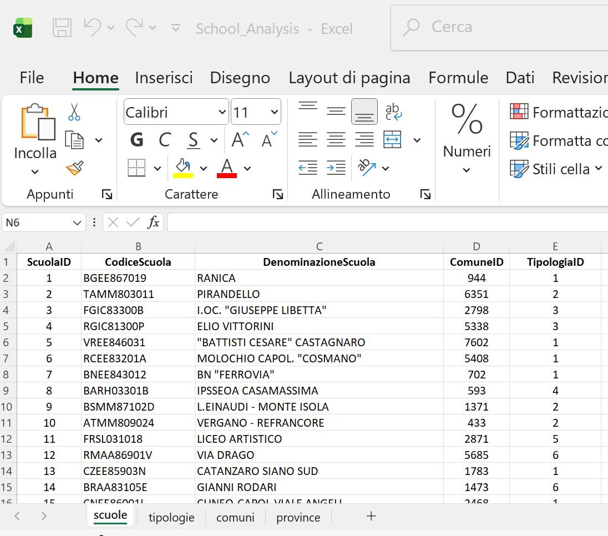
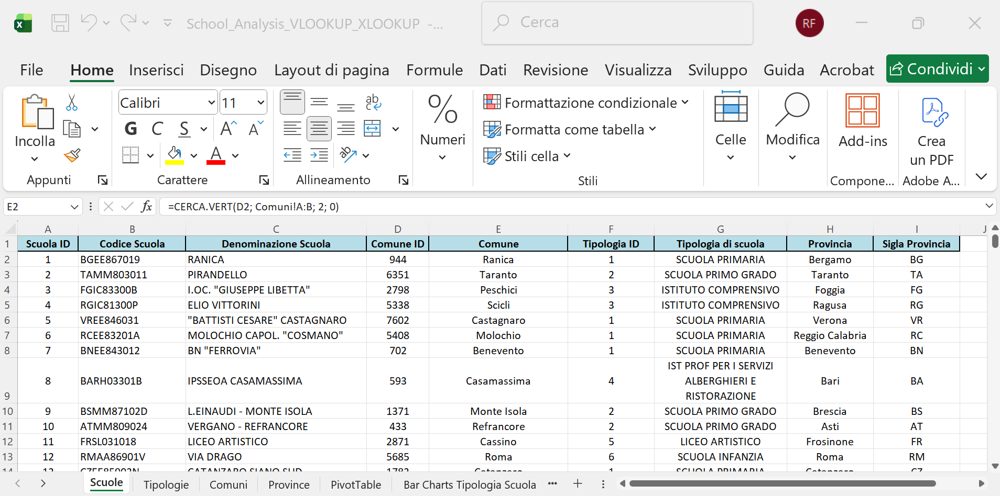
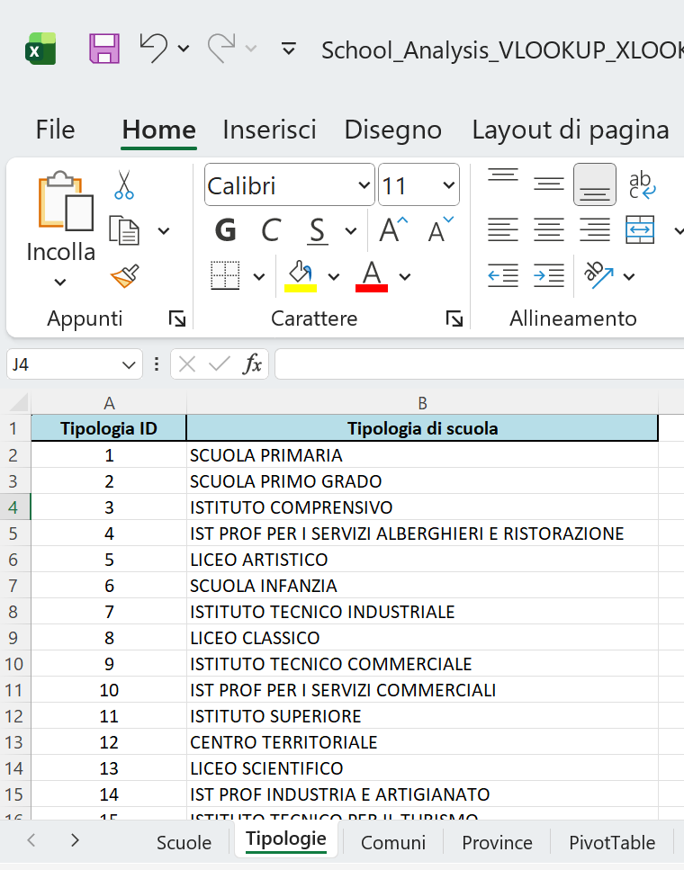
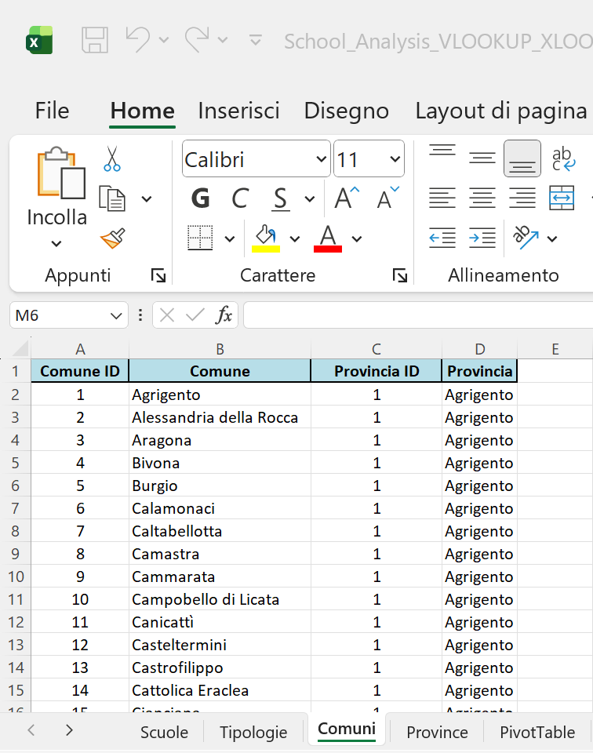
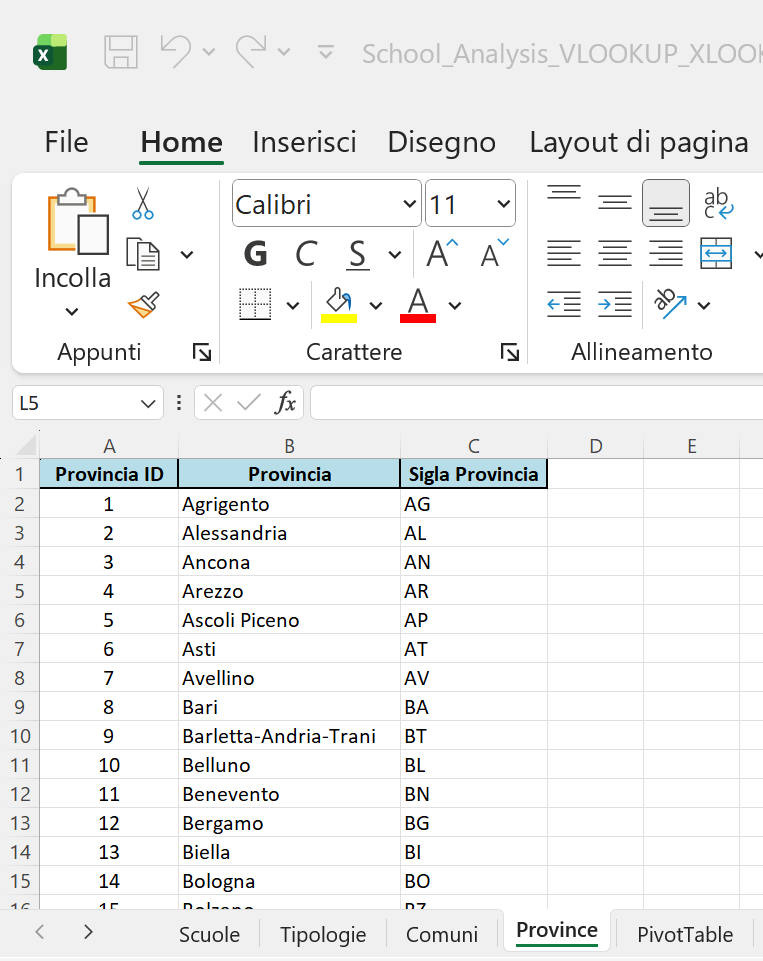
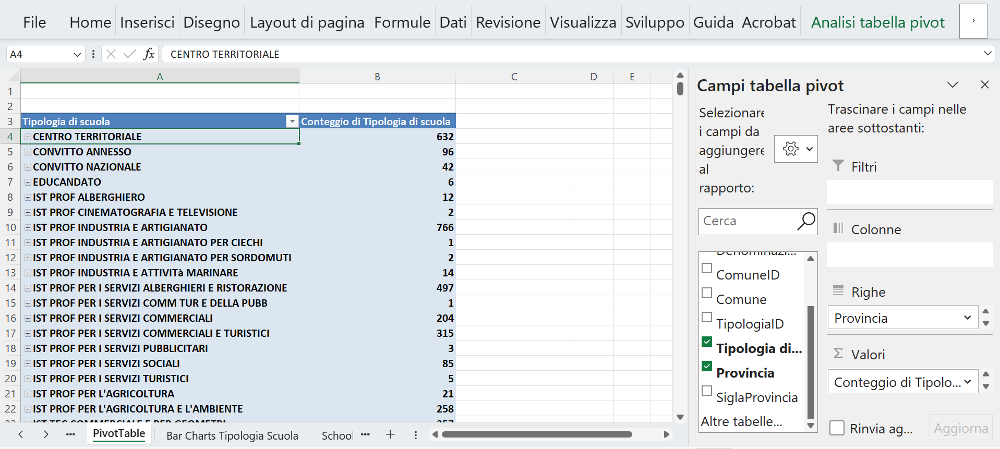
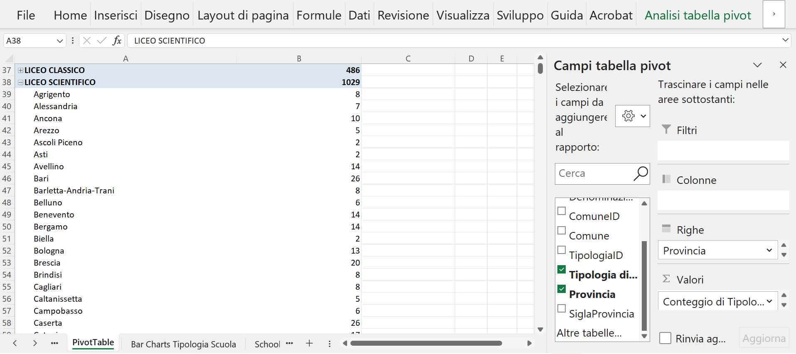

# 🇮🇹 Italian Schools Analysis Project (2025)

---

## 📊 Data Source Overview

The analysis is based on the following initial file:

**File:** `School_Analysis.xlsx`

This file contains information for **51,091 public schools in Italy** for the academic year 2025/2026. The Excel file is structured across **4 sheets**: `scuole`, `tipologie`, `comuni`, and `province`.

### Origin and Adaptation
The data was adapted and simplified from the original CSV file:
`SCUANAGRAFESTAT20252620250901.csv`

The source data is openly published by the Ministry of Education (MIUR).

**Source Link:** [Dati Istruzione (MIUR) - Distribuzione 2025/2026](https://dati.istruzione.it/opendata/opendata/catalogo/elements1/?area=Scuole)
*(To download the original CSV file, click on “Distribuzione per ANNOSCOLASTICO 202526” on the source page.)*

---

## 🏛️ Main Data Sheet: "scuole"

The "scuole" sheet holds the core institutional data. Below is a detailed description of the main columns included in this file:

| Column Name | Description |
| :--- | :--- |
| **ScuolaID** | *Unique numeric identifier for the school, used as the primary key.* |
| **CodiceScuola** | *Official alphanumeric Ministry of Education code for the school.* |
| **DenominazioneScuola** | *Full, official name of the school.* |
| **ComuneID** | *Foreign key linking the school to the corresponding Comune (municipality) in the "comuni" lookup sheet.* |
| **TipologiaID** | *Foreign key linking the school to the corresponding school type (Tipo di scuola) in the "tipologie" lookup sheet.* |

### Data Structure Visual

The structure of the main sheet is shown below for quick reference:

*Caption: The first columns of the "scuole" sheet, which uniquely identify each institution and link it to the lookup tables (Comuni and Tipologie).*

---
## 🔎 Lookup Sheets

The `School_Analysis.xlsx` file includes three supporting sheets used to normalize and categorize data found in the main "scuole" sheet.

### 2.1 Tipologie (School Types)

This small lookup sheet defines the classification of schools by type (e.g., Primary School, Secondary School, etc.). It helps to easily filter the main data.

| Column Name | Description |
| :--- | :--- |
| **TipologiaID** | *Unique numeric identifier for the school type (Primary Key).* |
| **Tipologia** | *Full description of the school type.* |

### 2.2 Comuni (Municipalities)

This sheet provides geographical data for the municipalities where the schools are located.

| Column Name | Description |
| :--- | :--- |
| **ComuneID** | *Unique numeric identifier for the Municipality (Primary Key), referenced by the "scuole" sheet.* |
| **Comune** | *Official name of the Italian Municipality.* |
| **ProvinciaID** | *Foreign key linking the Comune to the corresponding Province (Provincia) in the "province" lookup sheet.* |

### 2.3 Province (Provinces)

This sheet is the highest-level geographical lookup, linking municipalities to their respective provinces.

| Column Name | Description |
| :--- | :--- |
| **ProvinciaID** | *Unique numeric identifier for the Province (Primary Key), referenced by the "comuni" sheet.* |
| **Provincia** | *Full name of the Italian Province.* |
| **Sigla** | *Official two-letter abbreviation/code for the Province.* |

---
## 📝 Data Enrichment and Analysis Setup

After normalizing the data model, the core "scuole" sheet was enriched by adding descriptive columns using Excel lookup functions (VLOOKUP and XLOOKUP) applied across the four sheets.

A new file, `School_Analysis_VLOOKUP_XLOOKUP.xlsx`, was created for this step. The following descriptive columns were added and populated:

| Target Column | Description | Lookup Function |
| :--- | :--- | :--- |
| **Comune** | Municipality name | `VLOOKUP` |
| **Tipologia di scuola** | Type of school | `VLOOKUP` |
| **Provincia** | Province name | `XLOOKUP` |
| **Sigla Provincia** | Province abbreviation | `XLOOKUP` |

### Lookup Formulas Used:

The formulas used to link the descriptive data back to the main sheet were:

| Target Column | Formula Logic (English) | Keys Used |
| :--- | :--- | :--- |
| **Comune** | `=VLOOKUP(D2, comuni!A:B, 2, FALSE)` | `ComuneID` against `comuni!ComuneID` |
| **Tipologia di scuola** | `=VLOOKUP(F2, tipologie!A:B, 2, FALSE)` | `TipologiaID` against `tipologie!Tipologia` |
| **Provincia** | `=XLOOKUP(D2, comuni!A:A, comuni!D:D)` | `ComuneID` against `comuni!ProvinciaID` |
| **Sigla Provincia** | `=XLOOKUP(H2, province!B:B, province!C:C)` | `Provincia` name against `province!Sigla` |

### 🖼️ File Visuals

The following views of the enriched **`scuole`** sheet in `School_Analysis_VLOOKUP_XLOOKUP.xlsx` illustrate the column structure and the application of the lookup formulas:

* **View 1: Initial Enrichment**
    
    *Caption: The main sheet structure after adding the first descriptive columns.*

* **View 2: Tipologia Lookup**
    
    *Caption: VLOOKUP is used to populate the 'Tipologia di scuola' column using the 'tipologie' sheet.*

* **View 3: Comune/ProvinciaID Lookup**
    
    *Caption: VLOOKUP and XLOOKUP operations used to retrieve Municipality details.*

* **View 4: Sigla Provincia Lookup**
    
    *Caption: XLOOKUP is used to finalize geographical details, retrieving the 'Sigla Provincia'.*

---
## 📈 Pivot Table Analysis

Following the data enrichment, a Pivot Table was created to quickly analyze the distribution of school types across the different provinces.

### Pivot Table Structure

A new sheet, **"PivotTable"**, was created with the following structure:

* **Rows:** "Tipologia di scuola" and "Provincia"
* **Values:** Count of "Tipologia di scuola" (to count the number of schools)

This configuration allows for drilling down into the specific count of each school type per province.

### Visual Analysis

* **Screenshot 6: Structure Overview**
    
    *Caption: The structure of the Pivot Table Analysis, showing "Tipologia di scuola" (type of school) in the first column, grouped by type.*

* **Screenshot 7: Expanded View (Liceo Scientifico)**
    
    *Caption: Detailed view of the 'Liceo Scientifico' category, showing a total of 1,029 schools distributed alphabetically across the various provinces (e.g., 8 in Agrigento, 7 in Alessandria, 10 in Ancona).*

---