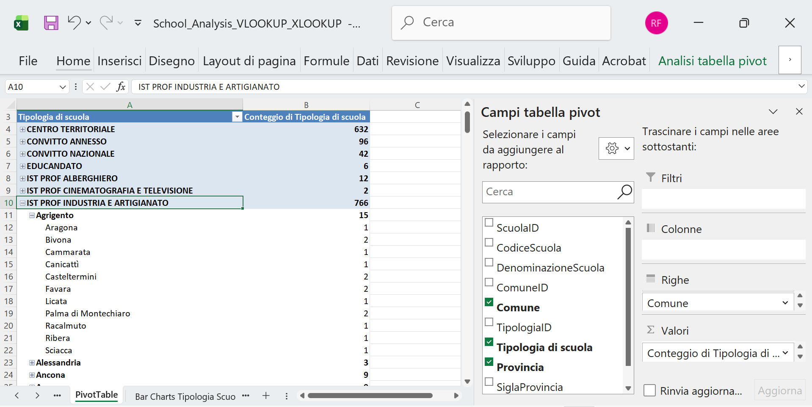
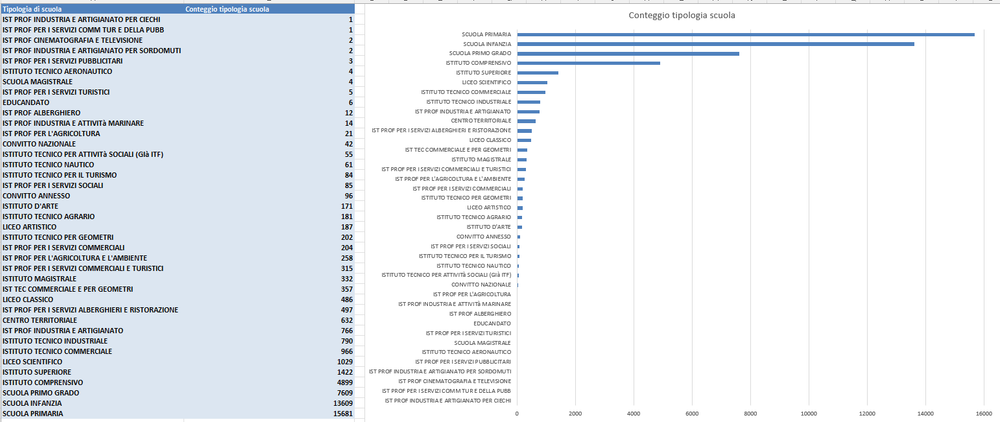
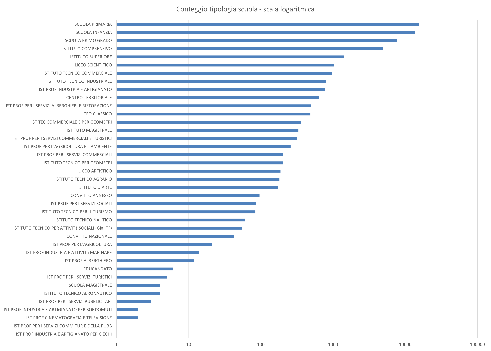
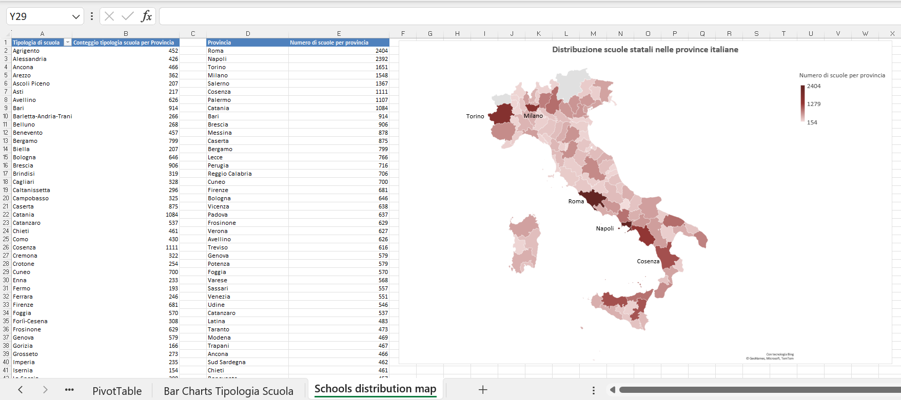
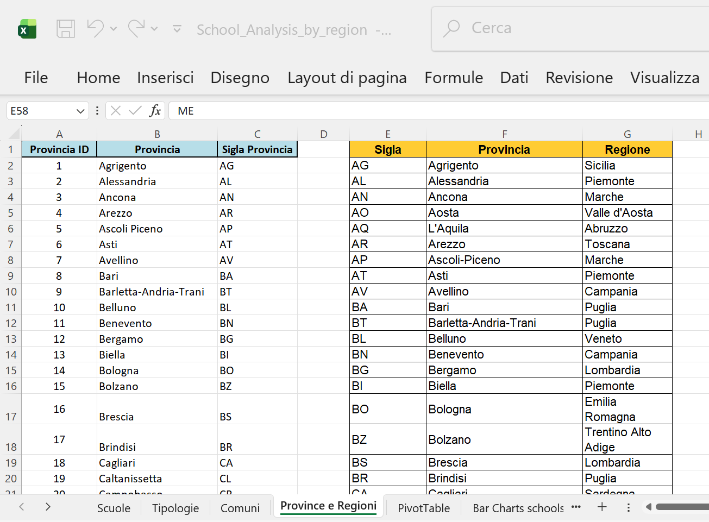
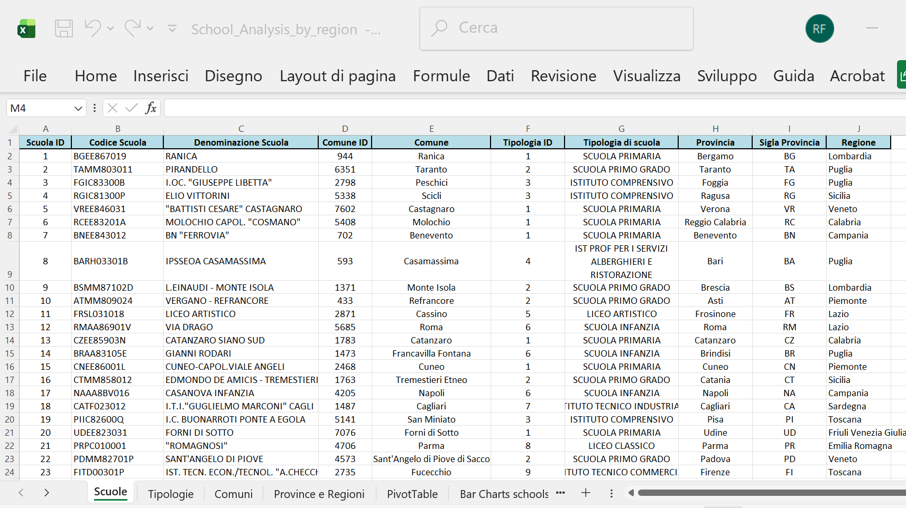
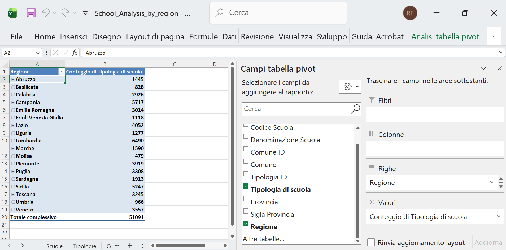
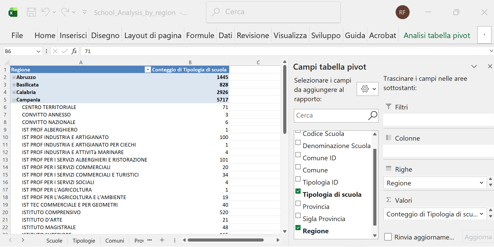
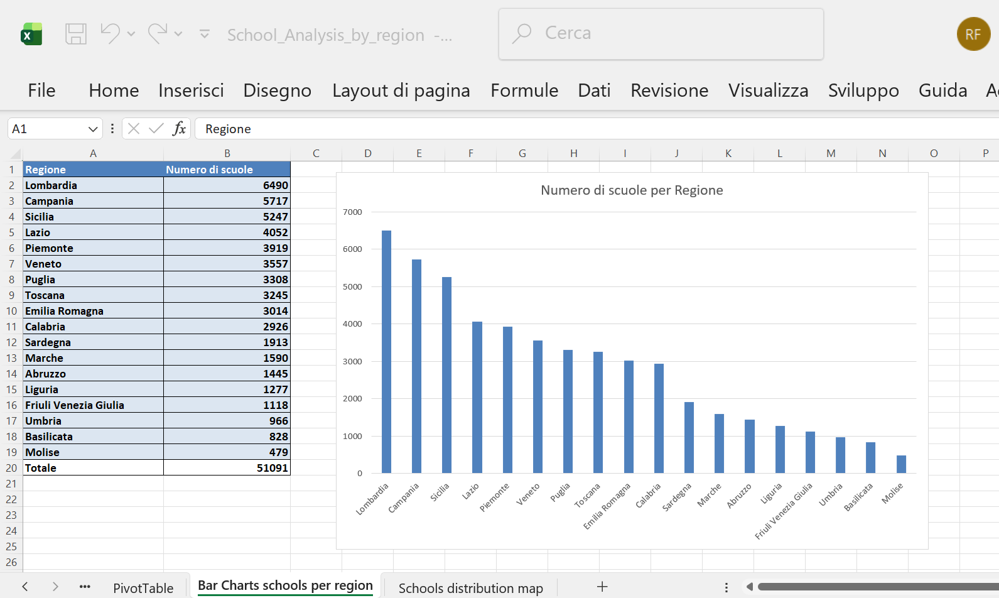

# 🇮🇹 Italian Schools Analysis Project (2025)

---

## 📊 Data Source Overview

The analysis is based on the following initial file:

**File:** `School_Analysis.xlsx`

This file contains information for **51,091 public schools in Italy** for the academic year 2025/2026. The Excel file is structured across **4 sheets**: `scuole`, `tipologie`, `comuni`, and `province`.

### Origin and Adaptation
The data was adapted and simplified from the original CSV file:
`SCUANAGRAFESTAT20252620250901.csv`

The source data is openly published by the Ministry of Education (MIUR).

**Source Link:** [Dati Istruzione (MIUR) - Distribuzione 2025/2026](https://dati.istruzione.it/opendata/opendata/catalogo/elements1/?area=Scuole)
*(To download the original CSV file, click on “Distribuzione per ANNOSCOLASTICO 202526” on the source page.)*

---

## 🏛️ Main Data Sheet: "scuole"

The "scuole" sheet holds the core institutional data. Below is a detailed description of the main columns included in this file:

| Column Name | Description |
| :--- | :--- |
| **ScuolaID** | *Unique numeric identifier for the school, used as the primary key.* |
| **CodiceScuola** | *Official alphanumeric Ministry of Education code for the school.* |
| **DenominazioneScuola** | *Full, official name of the school.* |
| **ComuneID** | *Foreign key linking the school to the corresponding Comune (municipality) in the "comuni" lookup sheet.* |
| **TipologiaID** | *Foreign key linking the school to the corresponding school type (Tipo di scuola) in the "tipologie" lookup sheet.* |

### Data Structure Visual

The structure of the main sheet is shown below for quick reference:

*Caption: The first columns of the "scuole" sheet, which uniquely identify each institution and link it to the lookup tables (Comuni and Tipologie).*

---
## 🔎 Lookup Sheets

The `School_Analysis.xlsx` file includes three supporting sheets used to normalize and categorize data found in the main "scuole" sheet.

### 2.1 Tipologie (School Types)

This small lookup sheet defines the classification of schools by type (e.g., Primary School, Secondary School, etc.). It helps to easily filter the main data.

| Column Name | Description |
| :--- | :--- |
| **TipologiaID** | *Unique numeric identifier for the school type (Primary Key).* |
| **Tipologia** | *Full description of the school type.* |

### 2.2 Comuni (Municipalities)

This sheet provides geographical data for the municipalities where the schools are located.

| Column Name | Description |
| :--- | :--- |
| **ComuneID** | *Unique numeric identifier for the Municipality (Primary Key), referenced by the "scuole" sheet.* |
| **Comune** | *Official name of the Italian Municipality.* |
| **ProvinciaID** | *Foreign key linking the Comune to the corresponding Province (Provincia) in the "province" lookup sheet.* |

### 2.3 Province (Provinces)

This sheet is the highest-level geographical lookup, linking municipalities to their respective provinces.

| Column Name | Description |
| :--- | :--- |
| **ProvinciaID** | *Unique numeric identifier for the Province (Primary Key), referenced by the "comuni" sheet.* |
| **Provincia** | *Full name of the Italian Province.* |
| **Sigla** | *Official two-letter abbreviation/code for the Province.* |

---
## 📝 Data Enrichment and Analysis Setup

After normalizing the data model, the core "scuole" sheet was enriched by adding descriptive columns using Excel lookup functions (VLOOKUP and XLOOKUP) applied across the four sheets.

A new file, `School_Analysis_VLOOKUP_XLOOKUP.xlsx`, was created for this step. The following descriptive columns were added and populated:

| Target Column | Description | Lookup Function |
| :--- | :--- | :--- |
| **Comune** | Municipality name | `VLOOKUP` |
| **Tipologia di scuola** | Type of school | `VLOOKUP` |
| **Provincia** | Province name | `XLOOKUP` |
| **Sigla Provincia** | Province abbreviation | `XLOOKUP` |

### Lookup Formulas Used:

The formulas used to link the descriptive data back to the main sheet were:

| Target Column | Formula Logic (English) | Keys Used |
| :--- | :--- | :--- |
| **Comune** | `=VLOOKUP(D2, comuni!A:B, 2, FALSE)` | `ComuneID` against `comuni!ComuneID` |
| **Tipologia di scuola** | `=VLOOKUP(F2, tipologie!A:B, 2, FALSE)` | `TipologiaID` against `tipologie!Tipologia` |
| **Provincia** | `=XLOOKUP(D2, comuni!A:A, comuni!D:D)` | `ComuneID` against `comuni!ProvinciaID` |
| **Sigla Provincia** | `=XLOOKUP(H2, province!B:B, province!C:C)` | `Provincia` name against `province!Sigla` |

### 🖼️ File Visuals

The following views of the enriched **`scuole`** sheet in `School_Analysis_VLOOKUP_XLOOKUP.xlsx` illustrate the column structure and the application of the lookup formulas:

* **View 1: Initial Enrichment**
    
    *Caption: The main sheet structure after adding the first descriptive columns.*

* **View 2: Tipologia Lookup**
    
    *Caption: VLOOKUP is used to populate the 'Tipologia di scuola' column using the 'tipologie' sheet.*

* **View 3: Comune/ProvinciaID Lookup**
    
    *Caption: VLOOKUP and XLOOKUP operations used to retrieve Municipality details.*

* **View 4: Sigla Provincia Lookup**
    
    *Caption: XLOOKUP is used to finalize geographical details, retrieving the 'Sigla Provincia'.*

---
## 📈 Pivot Table Analysis

Following the data enrichment, a Pivot Table was created to quickly analyze the distribution of school types across the different provinces.

### Pivot Table Structure

A new sheet, **"PivotTable"**, was created with the following structure:

* **Rows:** "Tipologia di scuola" and "Provincia"
* **Values:** Count of "Tipologia di scuola" (to count the number of schools)

This configuration allows for drilling down into the specific count of each school type per province.

### Visual Analysis

* **Screenshot 6: Structure Overview**
    
    *Caption: The structure of the Pivot Table Analysis, showing "Tipologia di scuola" (type of school) in the first column, grouped by type.*

* **Screenshot 7: Expanded View (Liceo Scientifico)**
    
    *Caption: Detailed view of the 'Liceo Scientifico' category, showing a total of 1,029 schools distributed alphabetically across the various provinces (e.g., 8 in Agrigento, 7 in Alessandria, 10 in Ancona).*

---
### Analysis Refinement: Granularity by Municipality

By further modifying the Pivot Table structure and adding the **"Comune"** field to the **Rows** area, the analysis achieves a finer level of detail. This action allows the count of each type of school to be displayed not just by Province, but broken down by individual Municipality.

* **Screenshot 8: Adding Municipality to Rows**
    
    *Caption: The structure of the Pivot Table after adding the 'Comune' field to the Rows area for deeper geographic granularity.*

    ### Visualizing Distribution: Bar Charts Analysis

To better visualize the quantitative differences between school types, data from the Pivot Table was copied and pasted into a new sheet, **"Bar Charts Tipologia Scuola"**.

A bar chart, titled **"Conteggio tipologia scuola per Provincia"** (Count of school types per Province), was created and sorted in descending order based on the count.

#### Key Findings & Visualization Adjustments:

The analysis immediately highlights the dominance of categories like **Scuola primaria** (Primary school), **Infanzia**, **Primo grado**, and **Istituto comprensivo**.

The disparity in school count is significant (e.g., 15,681 records for "Scuola primaria" versus 1-2 records for less common types like "Ist Prof Industria E Artigianato Per Ciechi"). This extreme difference necessitates an adjustment for effective visualization:

* **Linear Scale (Standard):** Fails to properly display the count of the less common school types.
    
* **Logarithmic Scale:** To better display the differences among the less represented school types, the Y-axis was formatted to use a logarithmic scale (Right click axis -> Format Axis -> Logarithmic scale selected).
    

---

---
## 🗺️ Geographical Distribution: Choropleth Map

To visualize the total number of schools per province, the data was extracted from the Pivot Table and used to generate a choropleth map of Italy.

### Map Creation Steps

1.  **Data Preparation:** A new sheet named **"Schools distribution map"** was created. Columns containing the **Province** and the **Count of schools per province** were copied from the Pivot Table and pasted using the **"Copy Values"** option into columns D and E. This step was necessary to prevent Excel from automatically altering the data during map generation.
2.  **Column Renaming:** Columns D and E were renamed to **"Provincia"** and **"Numero di scuole per provincia"** (Number of schools per province), respectively.
3.  **Map Generation:** Columns D and E were selected, and the map was generated using **Insert > Maps** (Excel automatically detects the geographic names and uses geocoding via Bing Maps to create the choropleth).

### Visualization and Analysis

The map displays the distribution of the total number of schools per province.

* **Color Scale:** The default two-color sequential scale was modified to a **three divergent color scale in red**, ranging from light red (lower number of schools) to dark red (higher number of schools).
* **Missing Data:** Three provinces in the far North (**Aosta, Trento, and Bolzano**) are displayed in light grey due to missing data for this specific analysis.
* **Key Observations:**
    * The provinces with the **highest number of schools** are **Rome** and **Naples**, followed by **Turin** and **Milan**. This trend is generally correlated with the high population density and socio-economic importance of these metropolitan areas.
    * Surprisingly, **Salerno** and **Cosenza** occupy the fifth and sixth positions, despite not being large metropolitan areas with high population density.

* **Screenshot 10: Schools Distribution Map**
    
    *Caption: Choropleth map illustrating the number of schools distributed across Italian provinces.*

---

## 🌎 Regional Analysis Setup

To enable analysis at the regional level, the dataset was further enriched by adding the official Italian region name to the main `scuole` sheet.

### Data Preparation and Region Lookup

1.  **File Duplication:** The file `School_Analysis_VLOOKUP_XLOOKUP.xlsx` was copied and renamed **`School_Analysis_by_region.xlsx`**.
2.  **External Data Integration:** A lookup file containing official regional data (`province-italiane.xls` from the provided source) was downloaded. Columns **Sigla**, **Provincia**, and **Regione** were copied from this external file and pasted into columns E, F, and G of the existing **`Province`** sheet in the new file.
3.  **New Column Creation:** A new column, **"Regione"**, was created in the **`scuole`** sheet.

### Lookup Formula for Region

The **"Regione"** column was populated using the Italian Excel function `CERCA.X` (XLOOKUP) based on the **province abbreviation (`Sigla`)**:

$$
\text{Column } \mathbf{"Regione"} = \text{CERCA.X}(\text{I2}; \text{Province!E:E}; \text{Province!G:G})
$$

This formula uses the **Province Abbreviation (Sigla)** from the `scuole` sheet and looks up the corresponding **Regione** from the updated `Province` sheet.

### Visual Confirmation

* **Screenshot 11: Province Sheet Update**
    
    *Caption: The updated 'Province' sheet containing the new 'Regione' column (Column G).*

* **Screenshot 12: Scuole Sheet with Regione Column**
    
    *Caption: The 'scuole' sheet displaying the newly added 'Regione' column populated via XLOOKUP.*

---
### Pivot Table Update: Regional Distribution

The previous Pivot Table was deleted and replaced with a new structure to focus the analysis on the **Regional** distribution of schools, utilizing the newly added 'Regione' column.

### New Pivot Table Structure

* **Rows:** "Regione"
* **Values:** Count of "Tipologia di Scuola"

This revised structure allows for a high-level view of the number of educational institutions broken down by the 20 Italian regions. The total count remains **51,091 records**.

### Regional Analysis Visuals

* **Screenshot 13: Regional Structure Overview**
    
    *Caption: The structure of the updated Pivot Table Analysis, showing 'Regione' in the first column, grouped by school type, with a total count of 51,091 records.*

* **Screenshot 14: Expanded View (Campania Region)**
    
    *Caption: Detailed view of the 'Campania' region, showing a total of 5,717 schools grouped by their respective school type (e.g., 71 'Centro territoriale', 3 'Convitto annesso', 6 'Convitto Nazionale', etc.).*

---

### Visualizing Regional Distribution

The visual analysis was shifted to the regional level using the updated Pivot Table data.

#### Chart Creation Steps

1.  **Data Preparation:** Existing tables and graphs in the **"Bar Charts Tipologia Scuola"** sheet were deleted. The new Pivot Table data (grouped by Region) was copied and pasted into this sheet.
2.  **Chart Generation:** A new bar chart, titled **"Numero di scuole per Regione"** (Number of schools per Region), was created based on this data.

#### Key Findings and Observations

The analysis reveals the following distribution:

* **Highest Concentration:** The highest numbers of schools are found in **Lombardia, Campania, Sicilia, and Lazio**.
* **Lowest Concentration:** The lowest numbers are found in **Friuli Venezia Giulia, Umbria, Basilicata, and Molise**.

The distribution generally aligns with the population size and density of the respective regions (reference: [https://www.tuttitalia.it/regioni/densita/](https://www.tuttitalia.it/regioni/densita/)). However, the relationship is not always linear; for example, **Calabria** shows a relatively high number of schools compared to its population density. This suggests a potential area for further demographic and socio-economic investigation.

* **Screenshot 15: Regional Distribution Bar Chart**
    

---

---
## 🗺️ Regional Distribution Map

The final visualization focuses on the high-level geographical distribution of schools across the Italian regions.

### Map Creation Steps

1.  **Data Preparation:** The **Regioni** and **Numero di scuole** data from the updated Pivot Table was copied into the "Schools distribution map" sheet.
2.  **Map Generation:** The map **"Distribuzione scuole statali nelle regioni italiane"** (Distribution of state schools in Italian regions) was created following the same procedure used for the provincial map (Insert > Maps).

### Visualization Parameters

* **Color Scale:** The visualization uses a **3-Color Scale (divergent) in green** for clear distinction.
* **Scale Values:** The parameters were manually set to:
    * **Minimum:** 400
    * **Midpoint:** 2,500
    * **Maximum:** 5,000

* **Screenshot 16: Regional Schools Distribution Map**
    
    *Caption: Choropleth map illustrating the final distribution of state schools across the Italian regions, using a green 3-color scale.*

---